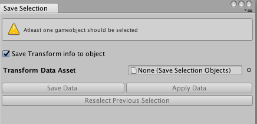
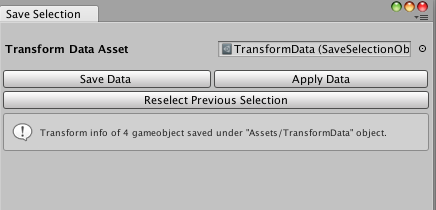

# SaveGameObjectData
This is a simple editor tool to save object data at runtime. Current setup has only option to save **Transform position, rotation and scale** information but can be easily expanded to save all types of component information.

## Development

This repo is under development

## License
This repo is under MIT License
